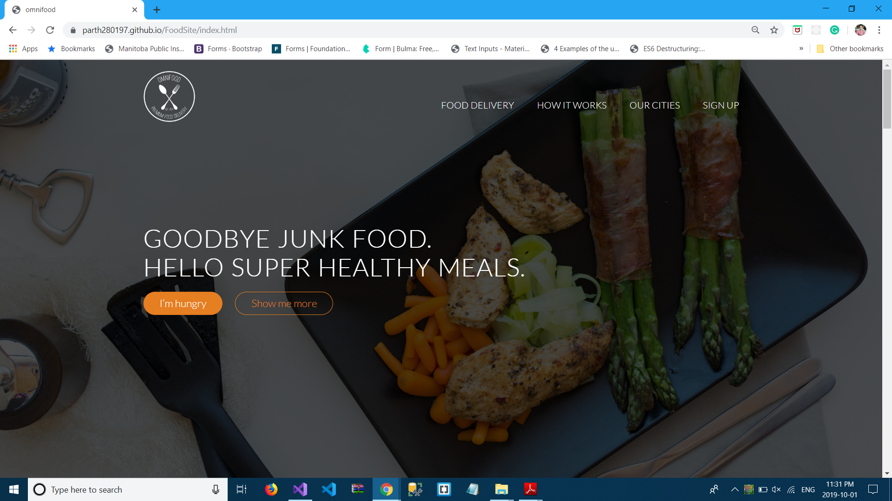
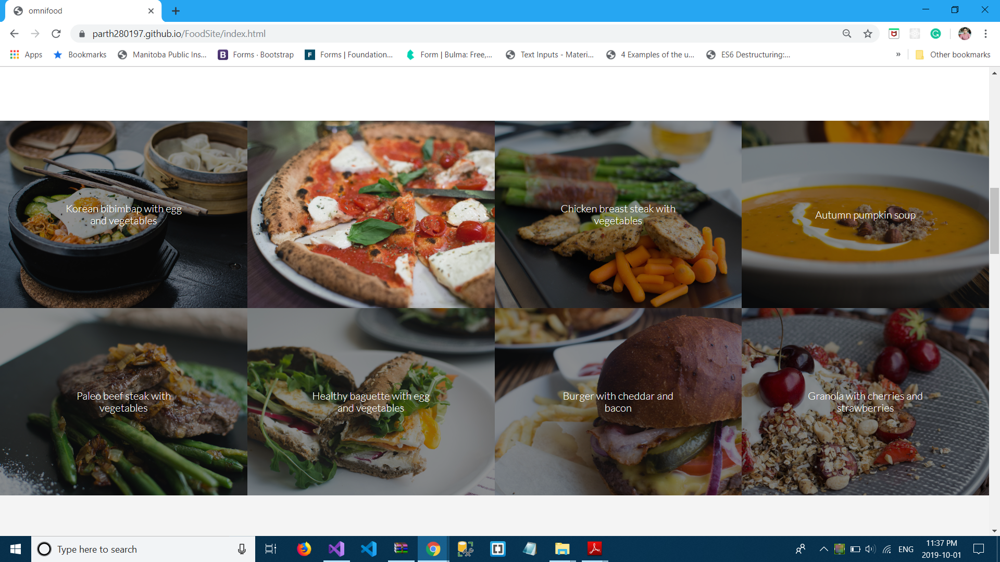
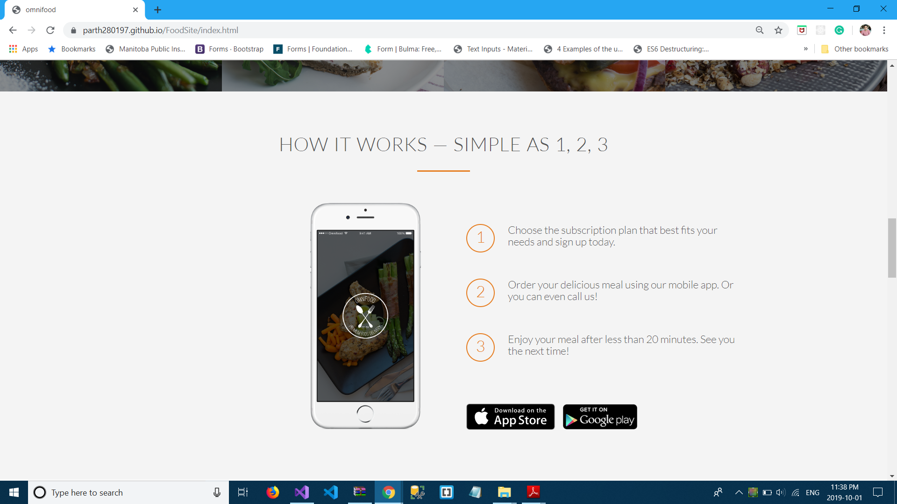
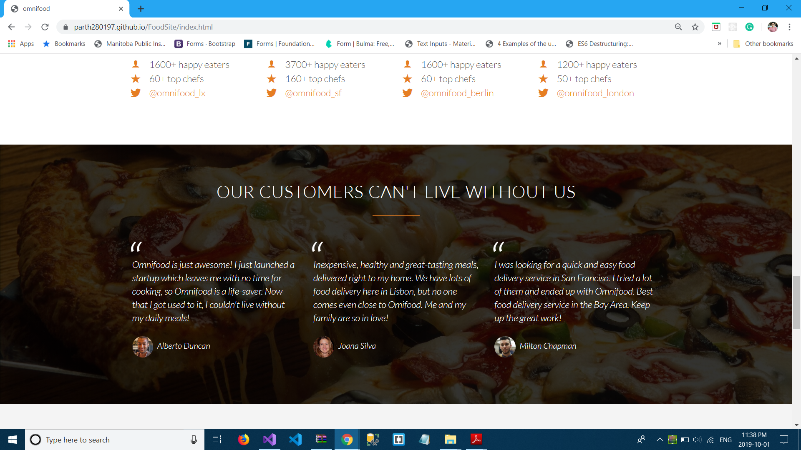

# FoodSite
## Technologies used
1. HTML
2. CSS
## Description
This site was part of udemy project in which I learned some of best designing practices and created this beutiful site.Which is responsive on all size of screens.
## Screen Shots
1. foodsite1

  

2. foodsite2

  
  
3. foodsite3

  
  
4. foodsite4

  
  
5. foodsite5

  
  
6. foodsite6

  
